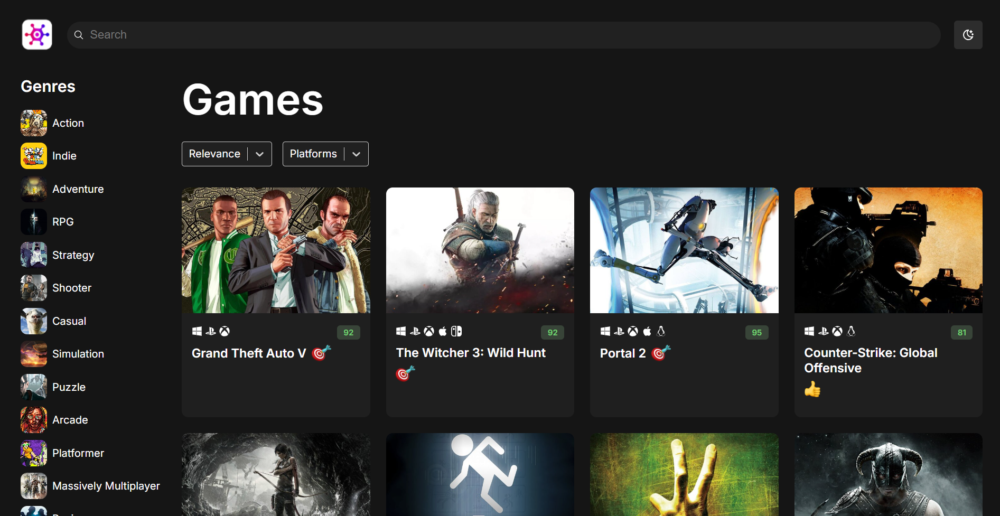
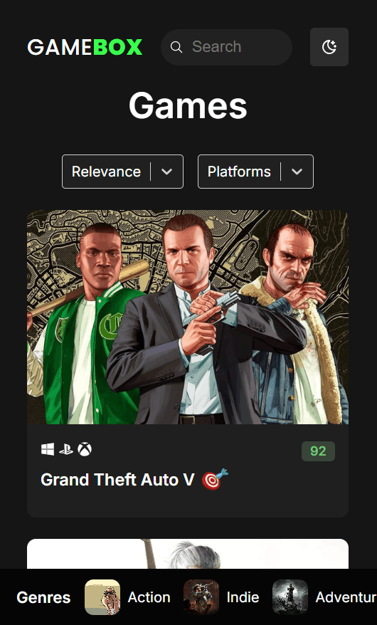

# GameBox

A **RAWG.io–inspired game discovery app** built with **React and TypeScript**.

<table>
  <tr>
    <td></td>
    <td></td>
  </tr>
</table>

Live demo: https://game-box-omega.vercel.app/<br>
Source code: https://github.com/jassmin27/game-box

---

This project focuses on **clean React architecture, reusable hooks, strong typing, and responsive UI behavior**, rather than visual polish.

---

## Features

* Browse games from the RAWG API
* Search games by name
* Filter by genre and platform
* Sort games by different criteria
* Dark / Light theme toggle (persisted in localStorage)
* Responsive layout

  * Desktop: sidebar genre list
  * Mobile: bottom horizontal genre list
* Loading skeletons for better UX
* Error handling and request cancellation

---

## Tech Stack

* React 18
* TypeScript
* Axios
* RAWG Video Games Database API
* CSS Modules
* react-loading-skeleton

---

## Key Concepts Practiced

* CSS Modules and theme-aware CSS variables
* Centralized filter state using a `GameQuery` object
* Strong typing with shared domain models
* Custom hooks for data fetching (`useGames`, `useGenres`)
* Axios API client with request cancellation
* Responsive UI without UI libraries
* Reusable, well-scoped components

---

## Project Structure (Simplified)

```
src/
├── components/
├── hooks/
├── services/
├── types/
├── App.tsx
└── main.tsx
```

---

## Setup

1. Clone the repository
2. Install dependencies
3. Add your RAWG API key to a `.env` file
4. Run the development server

---

## Notes

This project was built as a learning exercise to reinforce practical React patterns and application structure.

---

Built as a React learning project