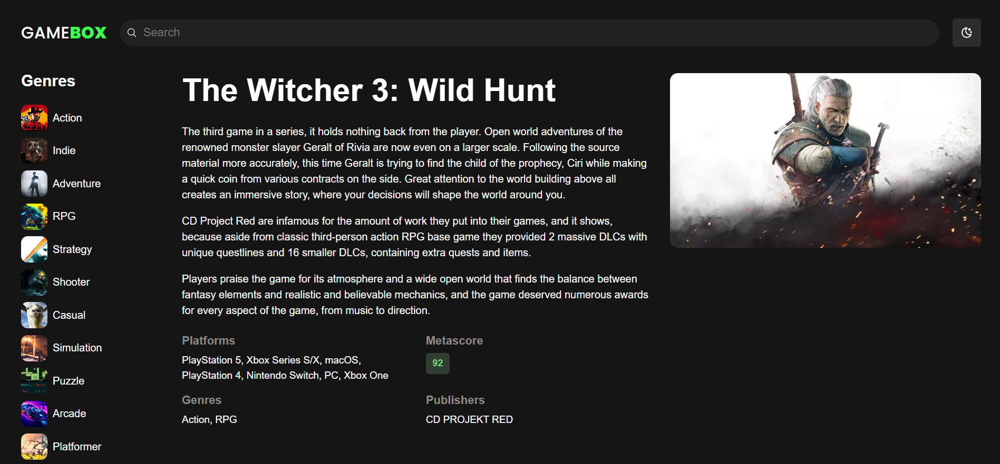

# GameBox 🎮

A [RAWG.io](https://rawg.io/)-inspired **game discovery app** that lets users browse, search, filter, sort, and view details for video games across genres and platforms, with dark/light theme support and a responsive layout.

GameBox is built with **React and TypeScript**, using **Zustand for client-side browsing state**, **TanStack React Query for server state and caching**, **React Router for navigation and URL-based search**, and the **RAWG API** for game data.

Live demo: https://game-box-omega.vercel.app

## Preview





## Features

- **Search** games by name
- **Filter** by genre and platform
- **Sort** games by different criteria
- **Game detail pages** with dynamic routes
- **URL-based search queries** that persist across refresh and browser navigation
- **Dark / Light theme toggle** persisted in localStorage
- **Responsive layout** across devices
  - Desktop: sidebar genre list
  - Mobile: bottom horizontal genre list
- **Loading skeletons** for better UX
- **Load more pagination** for game results
- **Error handling** and request cancellation

## Tech Stack

- React 18
- TypeScript
- React Router
- Zustand
- TanStack React Query
- Axios
- RAWG Video Games Database API
- CSS Modules
- react-loading-skeleton

## Architecture & Key Concepts

- **React Router** for page navigation, nested routes, dynamic game routes, and URL search parameters
- **Layout and Outlet** for shared navigation and page-level content
- **Zustand** for browsing state such as genre, platform, and sort order
- **URL search params** as the source of truth for game searches
- **TanStack React Query** for fetching, caching, pagination, and server state
- **Custom hooks** (`useGames`, `useGame`, `useGenres`, `usePlatforms`) to encapsulate data-fetching logic
- **Reusable API client** for collection and single-resource requests
- **Type-safe data handling** with shared TypeScript interfaces
- **Reusable components** with CSS Modules and theme-aware variables

## Project Structure (Simplified)

```text
src/
├── assets/       # images and media
├── components/   # reusable UI and container components
├── hooks/        # custom data-fetching hooks
├── pages/        # route-level pages
├── services/     # API client and utilities
├── store.ts      # Zustand browsing state
├── App.tsx       # shared application layout
├── main.tsx      # app entry point and routing
└── types.ts      # shared TypeScript types
```
